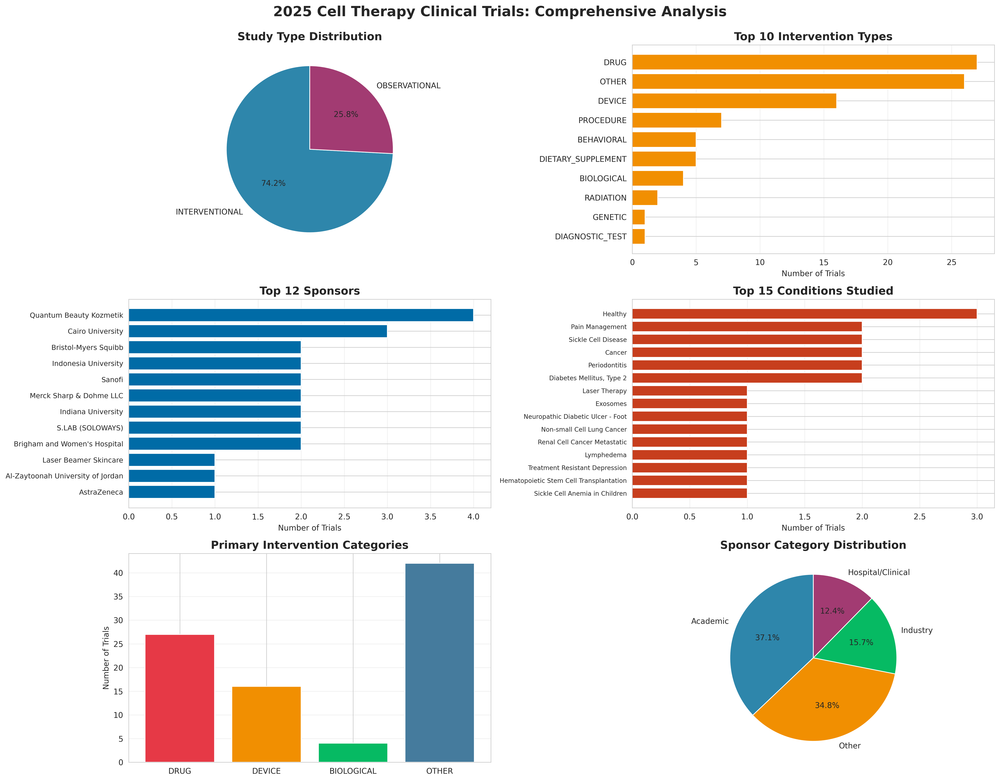

# Data_Technician
A repository for the Leep Talent Data Technician training

Hi  My name is Antonio Serrano
========================================================================================================================================

Fractional Product Leader | Biotech Strategy | Building tools for life sciences innovation
------------------------------------------------------------------------------------------

Product Strategist with 25 years navigating the intersection of science and business. I help early-stage biotech companies make smarter product decisions through fractional leadership and proprietary competitive intelligence. Former roles at Oxford University, Revvity, Bio-Rad, and Bio-Techne. Now building Bioicus Lab to solve the "Idle Valley Problem" - where promising spinouts waste capital on premature full-time hires during long R&D cycles

* 🌍  I'm based in Oxfordshire, UK 🇬🇧 & Atacama, Chile 🇨🇱
* 💼 See my portfolio at [My Github](http://github.com/Antilunio)
* ✉️  You can contact me at [antonio@bioicus.com](mailto:antonio@bioicus.com)
* 🚀  I'm currently working on [Seqtrend](http://www.seqtrend.com)
* 🧠  I'm currently learning scikit-learn on Python 🐍 for machine learning 🤖
* 🤝  I'm looking to collaborate on Bioinformatics 🧬
* 🎵  Vocals at [Lunar Kites](http://www.lunarkites.com)


# 2025 Cell Therapy Clinical Trials Analysis

Comprehensive analysis of completed cell therapy clinical trials from 2025, examining intervention types, sponsor landscape, and therapeutic focus areas.



## Overview

This project analyzes 89 completed clinical trials from 2025 focusing on cell therapy and related interventions. The analysis provides insights into:

- **Intervention Distribution**: Drug, device, biological, and other intervention types
- **Sponsor Landscape**: Industry, academic, and hospital-led research
- **Therapeutic Focus**: Most studied conditions and treatment approaches
- **Study Design**: Interventional vs. observational trial distribution

## Key Findings

### Trial Overview
- **89 completed trials** in 2025
- **74% interventional** studies (66 trials)
- **26% observational** studies (23 trials)

### Intervention Landscape
- **Drug-based**: 30.3% of trials
- **Device-based**: 18.0% of trials
- **Biological interventions**: 4.5% of trials

### Sponsor Distribution
- **Academic institutions**: 37.1% (leading category)
- **Other organizations**: 34.8%
- **Industry**: 15.7%
- **Hospital/Clinical**: 12.4%

### Top Research Areas
1. General health & wellness (3 trials)
2. Pain management (2 trials)
3. Sickle cell disease (2 trials)
4. Cancer (2 trials)
5. Periodontitis (2 trials)

## Repository Structure

```
cell-therapy-analysis-2025/
├── 2025_Cell_Therapy_Trials.csv          # Raw data from ClinicalTrials.gov
├── analyze_cell_therapy.py               # Analysis script
├── cell_therapy_analysis_2025.png        # Main dashboard (6-panel visualization)
├── intervention_types_2025.png           # Detailed intervention breakdown
├── trial_summary_2025.csv                # Summary statistics
└── README.md                             # This file
```

## Data Source

Data downloaded from [ClinicalTrials.gov](https://clinicaltrials.gov/) on February 2026.

**Search criteria**: Completed trials in 2025 related to cell therapy

## How to Use

### Requirements

```bash
pip install pandas matplotlib seaborn
```

### Run Analysis

```bash
python analyze_cell_therapy.py
```

This will generate:
- `cell_therapy_analysis_2025.png` - Main 6-panel dashboard
- `intervention_types_2025.png` - Intervention type bar chart
- `trial_summary_2025.csv` - Summary statistics

### Modify for Your Data

To analyze different datasets:

1. Replace `2025_Cell_Therapy_Trials.csv` with your data
2. Ensure your CSV has these columns:
   - NCT Number
   - Study Title
   - Study Status
   - Conditions
   - Interventions
   - Sponsor
   - Study Type
3. Run the script

## Visualizations

### Main Dashboard
6-panel comprehensive analysis showing:
1. Study type distribution (pie chart)
2. Top 10 intervention types
3. Leading sponsors (top 12)
4. Most studied conditions (top 15)
5. Primary intervention categories
6. Sponsor type distribution

### Intervention Types
Detailed bar chart of all intervention types found in the dataset.

## Insights & Applications

This analysis supports:
- **Research Planning**: Identify gaps in current therapeutic areas
- **Investment Decisions**: Understand which sponsors are most active
- **Competitive Intelligence**: Track intervention type trends
- **Market Analysis**: Academic vs. industry research focus

## Technical Details

**Languages & Libraries**:
- Python 3.8+
- pandas (data manipulation)
- matplotlib (visualization)
- seaborn (statistical graphics)
- Microsoft PowerAutomate and Excel for data capture

**Analysis Features**:
- Automated intervention type extraction
- Sponsor categorization (industry/academic/hospital)
- Condition frequency analysis
- Multiple visualization outputs


# 2025 Cell Therapy Clinical Trials Analysis

Comprehensive analysis of completed cell therapy clinical trials from 2025, examining intervention types, sponsor landscape, and therapeutic focus areas.


# Antibody Services Analysis

Commercial analytics for biotech products

![Main Dashboard]

## Data

1,030 commercial quotes from reagents business
- EMEA/AMER/APAC regions
- Customer accounts, lead times, outcomes
- Revenue and cost data

## Analysis

```bash
python antibody_services_analysis.py
```

Generates:
- Main dashboard (8 panels)
- Regional breakdown
- Summary CSV

## Key Metrics

- Total revenue: $3.1M
- Avg lead time: 8.4 days
- Avg response: 4.4 days
- Top region: AMER (61%)
- Top account: CUSTOMER (587 quotes)

## Outputs

- `antibody_services_dashboard.png` - Business metrics
- `antibody_services_regional.png` - Regional analysis
- `antibody_summary.csv` - Summary stats

## Stack

Python | pandas | matplotlib | seaborn


## Author

**Antonio Serrano**
- [[LinkedIn](#) (https://www.linkedin.com/in/aeserrano/) 

## Future Enhancements

- [ ] Time-series analysis (if multi-year data available)
- [ ] Geographic distribution mapping
- [ ] Therapeutic area deep-dives
- [ ] Collaboration network analysis
- [ ] Predictive modeling for trial success

## License

MIT License - Data from ClinicalTrials.gov (public domain)

---

*Analysis completed: February 2026*
